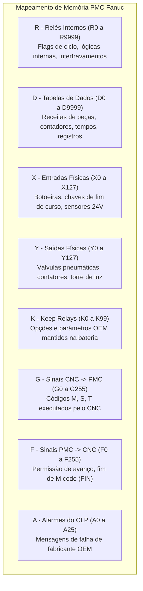

# 📘 Guia Completo de Parâmetros CNC e CLP (PMC) FANUC

Este guia contém as instruções completas para conectar em uma **máquina real Fanuc**, a lista dos **parâmetros CNC mais importantes** e o mapeamento dos **registradores do CLP (PMC)** para leitura e escrita segura.

---

## 🔌 1. O que Escolher em Configurações na Máquina Real

Para conectar seu computador ou sistema SCADA diretamente à máquina CNC Fanuc real:

### 1.1 Configurações na Máquina CNC (No Painel da Fanuc)
1. Pressione a tecla **`[SYSTEM]`** no painel do CNC.
2. Pressione a tecla de menu **`[ > ]`** até localizar **`[ETHPRM]`** (Parâmetros Ethernet).
3. Verifique e anote os dados de rede:
   - **IP Address do CNC:** Ex: `192.168.1.100`
   - **Subnet Mask:** Ex: `255.255.255.0`
   - **Porta FOCAS (TCP):** Padrão de fábrica **`8193`** (ou verifique o número configurado).
4. No seu computador, configure a placa de rede com IP estático na mesma faixa (ex: `192.168.1.50`, máscara `255.255.255.0`).
5. Faça um teste de ping no terminal: `ping 192.168.1.100`.

### 1.2 Configurações na Nossa Aplicação
Abra o Dashboard em **`http://localhost:3000`** -> Clique no botão **Conexão** (ou edite o arquivo `config.json`):

| Campo | Valor Recomendado para Máquina Real | Descrição |
|---|---|---|
| **Driver** | **`focas_dll`** (FOCAS DLL Nativa) | Usa as DLLs oficiais (`Fwlib32.dll` / `fwlib30i.dll` / `fwlib0iD.dll`) para leitura/escrita ultrarrápida direta de fábrica. |
| **Endereço Host (IP)** | `192.168.1.100` *(o IP do seu CNC)* | Endereço IP da placa Ethernet da máquina. |
| **Porta FOCAS** | `8193` | Porta Ethernet padrão do protocolo FOCAS 1 / 2. |
| **Timeout** | `5000` ms (5 segundos) | Tempo limite de resposta. |

---

## ⚙️ 2. Tabela de Parâmetros CNC Fanuc Mais Usados

| Nº Parâmetro | Eixo | Nome do Parâmetro | Tipo | Unidade | Descrição / Aplicação |
|---|---|---|---|---|---|
| **#0020** | Geral (0) | Canal de I/O | Byte | - | Define o canal de comunicação ativo (0/1=RS232, 4=Memory Card, 6=Ethernet FOCAS, 9=USB). |
| **#1020** | Por Eixo (1..N) | Nome do Eixo | Byte | ASCII | Define a letra do eixo: 88='X', 89='Y', 90='Z', 65='A', 66='B', 67='C'. |
| **#1420** | Por Eixo (1..N) | Avanço Rápido G00 | Long | mm/min | Velocidade máxima em movimento rápido (ex: 24000 = 24 m/min, 36000 = 36 m/min). |
| **#1421** | Por Eixo (1..N) | Avanço de Jog Manual | Long | mm/min | Velocidade máxima de movimentação manual pelo painel (ex: 3000 mm/min). |
| **#1430** | Por Eixo (1..N) | Limite Máximo de Usinagem | Long | mm/min | Teto máximo de avanço de corte (G01/G02/G03) para proteção mecânica. |
| **#1815** | Por Eixo (1..N) | Encoder / Ponto Zero | Bit | - | Bit 4 (APZ) = Zero de máquina referenciado (1=OK). Bit 5 (APC) = Encoder absoluto (1=Sim). |
| **#3741** | Geral (0) | RPM Máx. Spindle (Marcha 1) | Word | RPM | Rotação máxima do cabeçote na 1ª marcha (ex: 8000, 10000, 12000 RPM). |
| **#3742** | Geral (0) | RPM Máx. Spindle (Marcha 2) | Word | RPM | Rotação máxima na 2ª marcha mecânica (quando equipado com caixa de engrenagens). |
| **#5001** | Por Eixo (1..N) | Origem de Peça G54 (Work Offset) | Long | 0.001 mm | Posição de zero peça do sistema G54 (ex: 120450 = 120.450 mm). |
| **#5002** | Por Eixo (1..N) | Origem de Peça G55 | Long | 0.001 mm | Posição de zero peça G55 por eixo. |
| **#5003** | Por Eixo (1..N) | Origem de Peça G56 | Long | 0.001 mm | Posição de zero peça G56 por eixo. |
| **#5004** | Por Eixo (1..N) | Origem de Peça G57 | Long | 0.001 mm | Posição de zero peça G57 por eixo. |
| **#5005** | Por Eixo (1..N) | Origem de Peça G58 | Long | 0.001 mm | Posição de zero peça G58 por eixo. |
| **#5006** | Por Eixo (1..N) | Origem de Peça G59 | Long | 0.001 mm | Posição de zero peça G59 por eixo. |
| **#6711** | Geral (0) | Total de Peças Produzidas | Long | Peças | Contador acumulativo de peças usinadas (incrementa a cada ciclo M30/M02). |
| **#6712** | Geral (0) | Meta de Peças da Ordem | Long | Peças | Quantidade programada de peças para o lote. |

---

## 🎛️ 3. Mapeamento dos Registradores do CLP (PMC Fanuc)

O PMC (Programmable Machine Controller) da Fanuc possui 10 áreas de memória padronizadas:

### Detalhamento por Área:

1. **`R` (Internal Relays / Relés Internos):**
   - **Acesso:** Leitura e Escrita (RW).
   - **Exemplo:** `R1000.0` (Ciclo Automático Ligado), `R1000.1` (Porta Fechada), `R1000.2` (Bomba de Óleo em Pressão).
   - **Aplicação:** Troca de sinais com SCADA, automação de robô de carga e esteiras.

2. **`D` (Data Tables / Tabelas de Dados):**
   - **Acesso:** Leitura e Escrita (RW).
   - **Formatos:** `Byte` (8 bits), `Word` (16 bits) ou `Long` (32 bits).
   - **Exemplo:** `D500` (Número do lote atual), `D502` (Tempo de ciclo em décimos de segundo).

3. **`X` (Physical Inputs / Entradas Físicas):**
   - **Acesso:** Somente Leitura (R) no processo real (reflete os sensores de 24V).
   - **Exemplo:** `X0.0` (Botão Cycle Start pressionado), `X4.0` (Sensor de porta da cabine).

4. **`Y` (Physical Outputs / Saídas Físicas):**
   - **Acesso:** Leitura e Escrita (RW).
   - **Exemplo:** `Y0.0` (Ligar bomba de óleo solúvel M08), `Y0.3` (Lâmpada verde da torre de sinalização).

5. **`K` (Keep Relays / Relés de Retenção):**
   - **Acesso:** Leitura e Escrita (RW).
   - **Exemplo:** `K0.0` (Habilita abrir porta em manual), `K1.2` (Tipo de magazine de ferramentas).

---

## 🛡️ 4. Boas Práticas e Segurança na Escrita

> [!CAUTION]
> **Atenção ao Escrever Parâmetros de Eixos e Registradores Críticos:**
> 1. **Parâmetros de Posição (#5001 a #5006):** Sempre escreva em milésimos de milímetro (`1 mm = 1000 unidades`).
> 2. **Backup Prévio:** Antes de alterar parâmetros críticos de eixos (#1420, #1815), faça a leitura e anote os valores originais.
> 3. **Modo do CNC:** Parâmetros de máquina só podem ser alterados com a chave de proteção de parâmetros desmarcada no painel (`PWE = 1` na tela `SETTING`).
